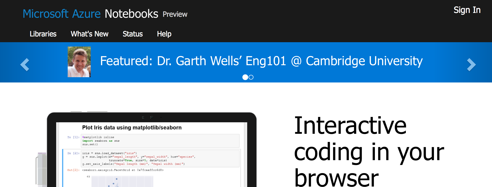
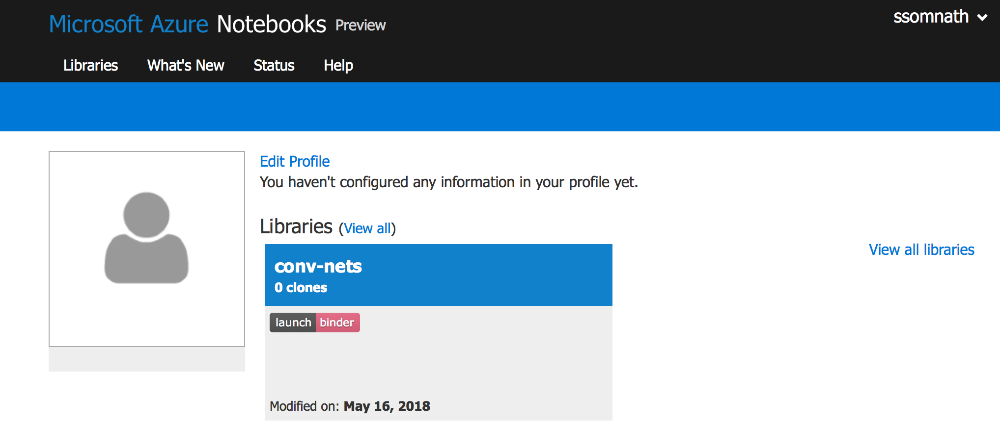
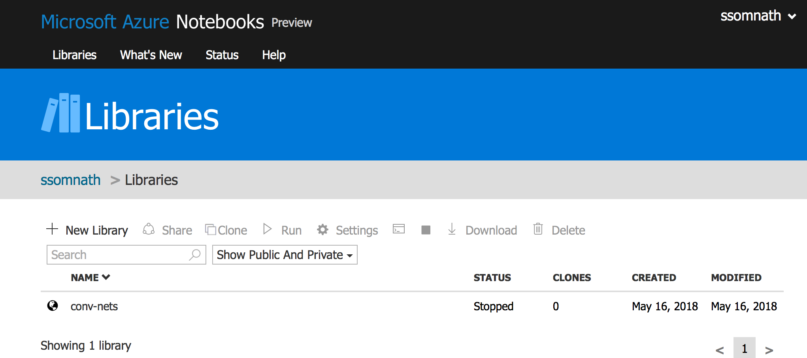
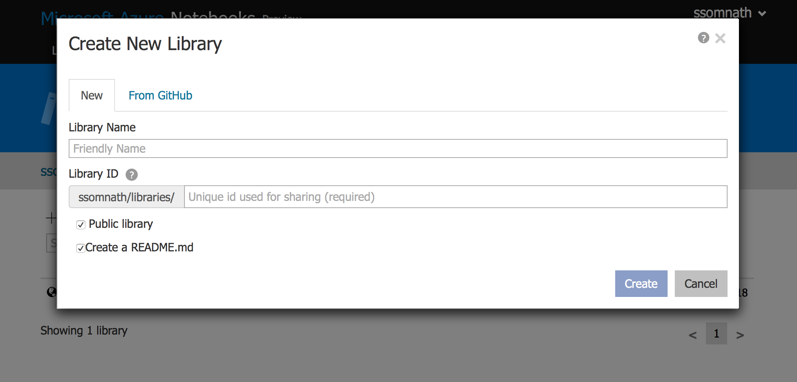
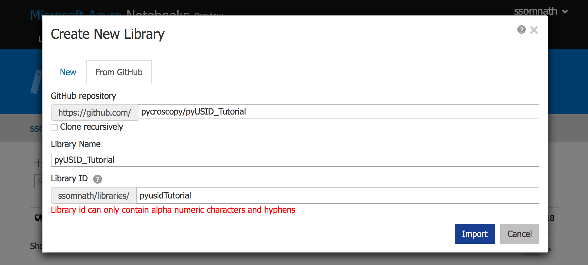
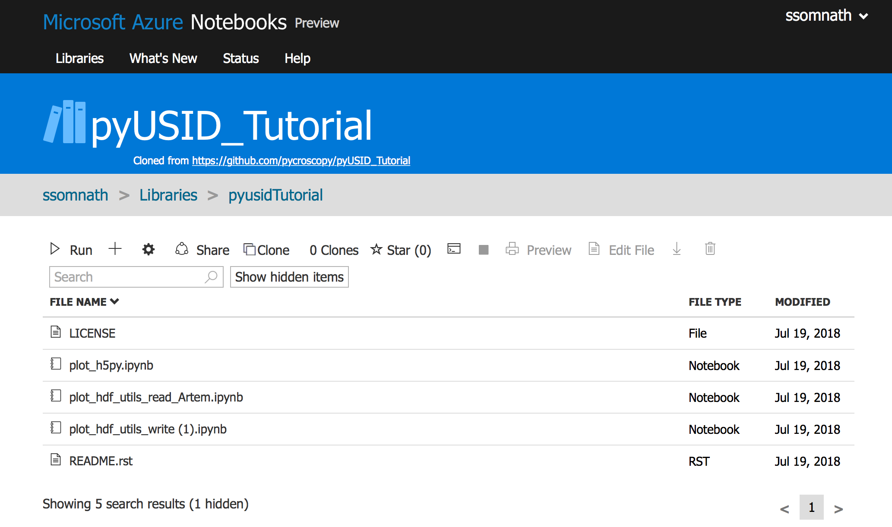
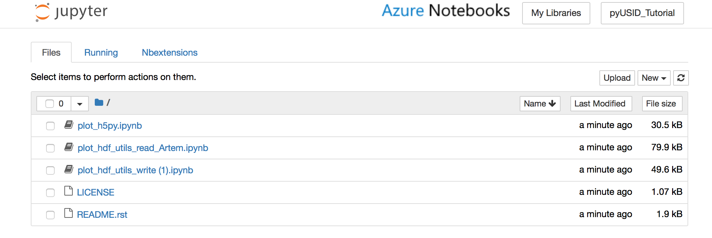

# Azure Notebooks Setup

Instructions for setting up an Azure Notebooks project from scratch below. 
**Users should only need to clone an existing Azure notebooks project instead of following these instructions.**

1.  Logging into Azure Notebooks:

    1.  You will need a free microsoft account (hotmail, etc.)
        for this
    2.  Click on **sign in** at the top in [this
        page](https://notebooks.azure.com)
        
    3. Log in with your microsoft credentials
2.  Adding the tutorial library:

    1.  Click on `Libraries`
        
    2.  Click on `+ New Library`
        
    3.  Select the `From GitHub` tab
        
    4.  Paste `https://github.com/pycroscopy/pyUSID_Tutorial`
        into the field named `GitHub repository`
        
    5.  Name your library however your want for the
        `Library Name`
    6.  Use an alpha-numeric name for the `Library ID`
    7. Click on the `Import` button on the bottom right
    
3.  Starting the notebook server

    1.  You should be presented with a page listing the files
        within the repository
        
    2.  Click on the `Run` button
        
